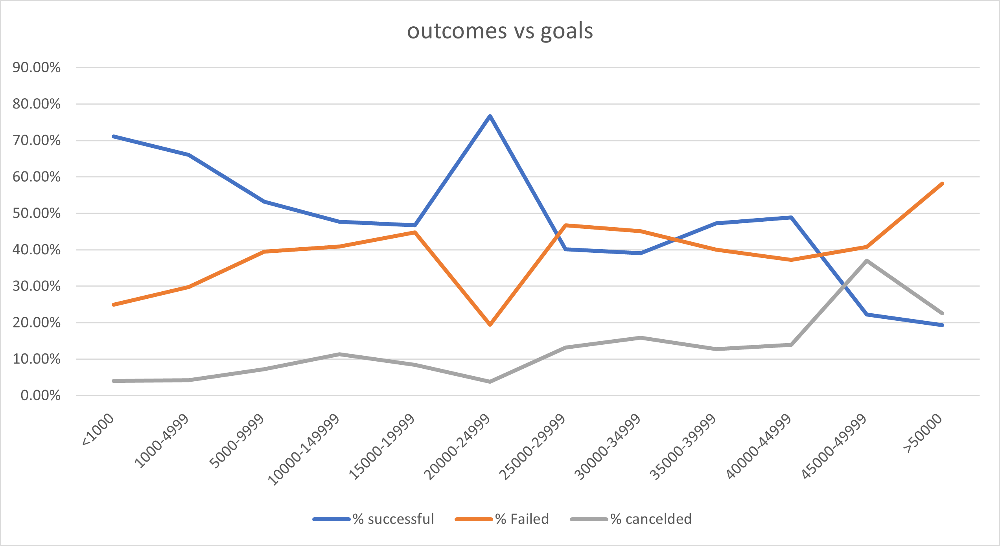

# Louis KickStarter campaign

## Project Overview and Purpose
The oveview of the project is to relay to Louis when is the best time to lauch their kickstarter, and what is the funding amount will yeild the best ouctome for it. furthermore, the main purpose of this analysis is two-fold. Firstly, it is to gauge when the most beneficial time is to launch a fundraising Kickstarter for a theatre play, and secondly to give louis a pricing budget that is most likely yield a successful fundraising campaign for their project.

## Anaylsis and Challanges
The analysis was preformed under several steps. Firstly, the data had to be cleaned, this involed colour coding the 'outcome' coloum, as well as coverteding the dates from *Epoch* into something that can be understood at a glace. After this, we then proceed to setup several tables and charts with the relevant information, anything pertaining to theatre/play as well as their outcome.(see image 1)

From this, when then were able to display the trends within the data presented. One of the first graphs created was the graph which displayed the total amount of Kickstarters in each category (see image 2). Another challenge that occurred was that the volume of data and pages also caused operational issues with the excel program, causing either slow downs or crashes. Furthermore, another issue faced was that the use of pivot tables and graphs were new to us, and thus having to use them for the first time caused problems with their implementation at first.

## Results and conclusion 
For all purposes, it appears that those that ask for more, are more likely to fail, and those who ask for less, are more likely to have a successful fundraising. This can be seen in the ‘outcomes’ line graph. Furthermore looking at the outcomes vs launch dates graph, it appears that those who campaign in the summer(Q2) are more likely then any other period of time (see 'Theather Outcomes by Launch date'). Thus, from the information provided, it can be concluded that if Louis wants to successfully fundraise the project, they have to firstly, start campaign in Q2 and secondly ask for $20,000-$24,999. Under these two parameters, it can be said that their likelihood of successfully kickstarting their play is more likely then not. So in conclusion, the best advice from the data provided and be summerized as to tell Louis that it would be best if they launch their campagin in the Summer while budgeting for roughly $20,000, and if this is met, to later place a stretch goal

## Limitation and Confounding Factors
However, that being said, the limitations of the data is that it does not account for the nature of the online landscape, that is positive and negative online word of mouth spread very quickly and public interest can be gained via other means such as social media. This issue could skew the data presented and thus cause the inflation of successful kickstarters. Therefore it's always important to understand certain memetic principles of the Internet, which could affect the data of the campaigns presented, as well could effect louis campaign
